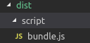
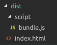

# 俄罗斯方快游戏

## 概述

- 使用技术：

    webpack + jquery + Typescript + 思想(面向对象开发）  


- 项目目的：

1. 学习ts 结合webpack开发
2. 巩固ts知识
3. 锻炼逻辑思维能力
4. 体验面向对象编程的思想


- 学习方法

1. 调整心态，不要浮躁
2. 理解 -> 思考 -> 实践 -> 思考 。。。


## 工程搭建

- 环境：

浏览器 + 模块化

webpack：构建工具，根据入口文件找寻依赖，打包文件


### 工程步骤


#### 1. 安装及配置webpack

##### 1.1 安装

```
npm install -D webpack webpack-cli

```
##### 1.2 配置webpack.config.js

```javascript
    const path = require('path'); // 引入node中path

    module.exports = {
        entry:"./scr/index.js",  // 入口文件，启动文件
        output:{   // 输出文件
            path:path.resolve('./dist'),  
            // 保存输出文件的路径，path是一个绝对路径，要用path转换
            filename:"script/bundle.js"   // 输出文件的路径及文件输出名
        }
    }
```

##### 1.3 运行文件

在 `package.json` 文件中配置命令
```json
    "scripts": {
        "build": "webpack --mode=production"
    }
```

```
    npm run build
```


可以看到编译后dist文件中有了`bundle.js`


#### 2. 安装 [html-webpack-plugin](https://www.npmjs.com/package/html-webpack-plugin)

用来处理html

##### 2.1 安装模块

```
npm i --save-dev html-webpack-plugin

```
##### 2.2 配置webpack.config.js

```javascript
    const path = require('path'); // 引入node中path
    const HtmlWebpackPlugin = require('html-webpack-plugin') // 引入

    module.exports = {
        entry:"", 
        output:{ },
        plugins:[
            new HtmlWebpackPlugin({
                // html 模板配置
                template:path.resolve(__dirname, 'public', 'index.html')
            })
        ]
    }
```
##### 2.3 运行文件

```
    npm run build
```


可以看到编译后dist文件中有了`index.html`


#### 3. 打包前清除dist目录

[clean-webpack-plugin](https://www.npmjs.com/package/clean-webpack-plugin)

#### 4. 自动运行包

[webpack-dev-server](https://www.npmjs.com/package/webpack-dev-server)


#### 5. 安装ts相应的 loader

- [ts-loader (官方)  ](https://www.npmjs.com/package/ts-loader)

- [awesome-typescript-loader](https://www.npmjs.com/package/awesome-typescript-loader)


##### 5.1 配置文件：

```json

module:{
    rules:[
        {
            test:/.tsx?$/,  //当读到以ts结尾的文件，交于ts-loader处理文件
            loader:"ts-loader"
        }
    ]
}

```

##### 5.2 报错

> 在配置万ts-loader之后，启动文件
> **Error:** Cannot find module 'typescript'

```
    npm i typescript --D   //它们都需要依赖于ts，需要在工程中安装ts
```


> **ERROR in [tsl] ERROR** 
> The 'files' list in config file 'tsconfig.json' is empty.

```
    tsc --init  //增加 tsconfig.json
```

> 多模块引入时，只会查找js文件，不会查找ts文件，会导致文件不能被找到

```json
    resolve:{
        extensions:[".ts",".js"]   // 配置文件 查找ts js 文件
    }
```

## 游戏开发

> 组件单一只能原则：每个类只做跟它相关的一件事

> 开闭原则：系统中的类应该对扩展开放，对修改关闭

> 基于以上两个原则，系统开发使用如下模式：
    数据 - 界面分离模式

> 传统面向对象语言，书写类的属性时，往往会进行如下操作：
    1.所有属性全部私有化    
    2.使用公开的方法提供对属性的访问


## 开发小方块

小方块类：能处理数据，知道什么时候显示，但是不知道界面如何显示

## 小方块的显示类

作用：用于将小方块显示到页面上


安装jquery

npm install jquery

安装jquery 类型验证：

npm install -D @types/jquery

## 开发方块的组合类

组合类中的属性：

- 小方块的数组：

思考：该数组的组成能不能发生变化。

回答：不能发生变化，是只读数组


一个方块组合，取决于组合的形状（一组相对坐标的组合，该组合中有一个特殊坐标表示形状的中心）

如果知道：形状，中心点坐标（在面板中的坐标），颜色，就可以设置小方块的数组

